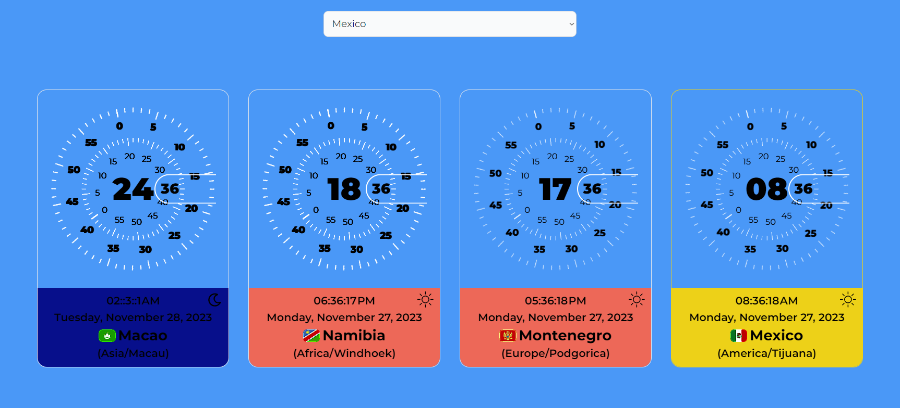

# Getting Started with Create React App

This project was bootstrapped with [Create React App](https://github.com/facebook/create-react-app).

## Available Scripts

In the project directory, you can run:

### `npm start`

Runs the app in the development mode.\
Open [http://localhost:3000](http://localhost:3000) to view it in your browser.

The page will reload when you make changes.\
You may also see any lint errors in the console.

### `npm test`

Launches the test runner in the interactive watch mode.\
See the section about [running tests](https://facebook.github.io/create-react-app/docs/running-tests) for more information.

### `npm run build`

Builds the app for production to the `build` folder.\
It correctly bundles React in production mode and optimizes the build for the best performance.

The build is minified and the filenames include the hashes.\
Your app is ready to be deployed!

See the section about [deployment](https://facebook.github.io/create-react-app/docs/deployment) for more information.

### `npm run eject`

**Note: this is a one-way operation. Once you `eject`, you can't go back!**

If you aren't satisfied with the build tool and configuration choices, you can `eject` at any time. This command will remove the single build dependency from your project.

Instead, it will copy all the configuration files and the transitive dependencies (webpack, Babel, ESLint, etc) right into your project so you have full control over them. All of the commands except `eject` will still work, but they will point to the copied scripts so you can tweak them. At this point you're on your own.

You don't have to ever use `eject`. The curated feature set is suitable for small and middle deployments, and you shouldn't feel obligated to use this feature. However we understand that this tool wouldn't be useful if you couldn't customize it when you are ready for it.

## Learn More

You can learn more in the [Create React App documentation](https://facebook.github.io/create-react-app/docs/getting-started).

To learn React, check out the [React documentation](https://reactjs.org/).

### Code Splitting

This section has moved here: [https://facebook.github.io/create-react-app/docs/code-splitting](https://facebook.github.io/create-react-app/docs/code-splitting)

### Analyzing the Bundle Size

This section has moved here: [https://facebook.github.io/create-react-app/docs/analyzing-the-bundle-size](https://facebook.github.io/create-react-app/docs/analyzing-the-bundle-size)

### Making a Progressive Web App

This section has moved here: [https://facebook.github.io/create-react-app/docs/making-a-progressive-web-app](https://facebook.github.io/create-react-app/docs/making-a-progressive-web-app)

### Advanced Configuration

This section has moved here: [https://facebook.github.io/create-react-app/docs/advanced-configuration](https://facebook.github.io/create-react-app/docs/advanced-configuration)

### Deployment

This section has moved here: [https://facebook.github.io/create-react-app/docs/deployment](https://facebook.github.io/create-react-app/docs/deployment)

### `npm run build` fails to minify

This section has moved here: [https://facebook.github.io/create-react-app/docs/troubleshooting#npm-run-build-fails-to-minify](https://facebook.github.io/create-react-app/docs/troubleshooting#npm-run-build-fails-to-minify)

# Time Zone Converter Web Application - Take-Home Test

## Objective
Develop a web application that allows users to convert time between different time zones.

## Duration
All submissions to be done by **27 November 2023 - 8 PM IST**

### Key Requirements

#### User Interface
- A simple and intuitive interface where a user can select a source and target time zone from dropdown menus.
- An input field to enter the time to be converted.
- A submit button to perform the conversion.
- A display area to show the converted time.

#### Functionality

- The application should accurately convert time between selected time zones.
- It should handle edge cases like Daylight Saving Time changes.

#### Data Sources

- Utilize a reliable API or data source for time zone information.

#### Programming Languages

- You may use any JavaScript frameworks you are comfortable with.

#### Code Quality

- Your code should be clean, well-organized, and commented where necessary.
- Include error handling and validations.

#### Responsiveness

- The application should be responsive and work on different devices and screen sizes.

#### Bonus Features (Optional)
- Ability to add multiple time zones for comparison.
- Historical time zone conversion (converting past/future dates).
- Localization (support for multiple languages).

#### Submission Guidelines

- Submit your code via GitHub.
- Fork this repository and submit a pull request against this repository.

#### Evaluation Criteria

- Functionality: Does the application work as intended?
- Code Quality: Is the code well-structured and maintainable?
- UI/UX Design: Is the user interface easy to use and visually appealing?
- Creativity and Use of Technology: How innovative and efficient is the solution?

#### Feedback:
- You will receive feedback within one week of submission.
